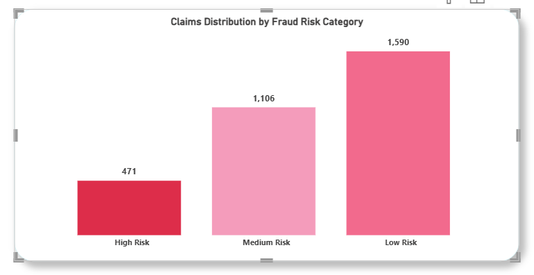
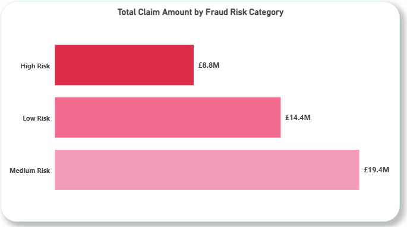
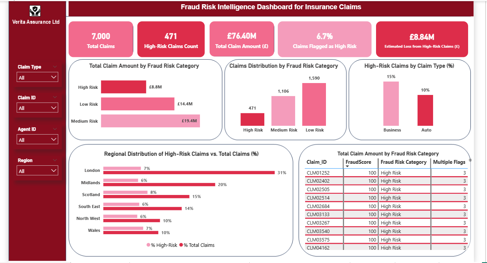

<h1 align="center">Driving Early Fraud Detection in Insurance Claims</h1>

<strong>Fraud Risk Analytics for Proactive Claims Investigation at Verita Assurance Ltd</strong>

  <em>A data-driven fraud analytics project focused on early detection, investigation prioritisation, and loss prevention in insurance claims.</em>

<h2>Project Background</h2>

  Verita Assurance Ltd. is a mid-sized insurance provider in the UK offering auto, home, travel, and business insurance.
  Over the past two years, the company recorded a <strong>14% increase in suspicious insurance claims</strong>. In many cases,
  potential fraud was only identified <strong>after claims had already been paid</strong>, leading to financial losses that could not
  be recovered and higher investigation costs.

  As claim volumes increased, the Risk Management team did not have a <strong>single, consistent way to identify high-risk claims early</strong>
  or decide <strong>which claims should be investigated first</strong>. Fraud checks were largely reactive, making it difficult to prevent losses
  before payouts were made and increasing both financial and compliance risk.

  To address this, a fraud risk analytics initiative was carried out using historical claims data. The aim was to
  <strong>identify recurring fraud patterns</strong>, <strong>assign fraud risk scores</strong>, and support <strong>earlier investigation of suspicious claims before settlement</strong>.

<h2>Scope of the Analysis</h2>

  The analysis reviewed <strong>over 7,000 insurance claims</strong> with a total claim value of <strong>£76.4M</strong> across auto, home, travel,
  and business insurance. Using a fraud scoring approach, <strong>471 claims worth £8.84M</strong> were flagged as high risk.

<ul>
  <li>Auto claims accounted for <strong>77.5%</strong> of high-risk claims</li>
  <li>Business claims made up the remaining <strong>22.5%</strong></li>
  <li>Fraud risk was highest in <strong>London</strong> and the <strong>Midlands</strong></li>
  <li><strong>16.1%</strong> of customers and a small number of agents were linked to repeated high-risk activity</li>
</ul>

  These findings highlighted clear patterns in where fraud risk is concentrated and provided a strong basis for improving fraud risk management.

<h2>Key Analytical Focus Areas</h2>

<ul>
  <li>
    <strong>Fraud Pattern Detection:</strong>
    Reviewing past claims to identify common signs of fraud such as repeated claims, unusually high claim values, and short policy duration.
  </li>
  <li>
    <strong>Risk Scoring and Classification:</strong>
    Assigning fraud risk scores (0–100) and grouping claims into High, Medium, and Low Risk to support investigation prioritization.
  </li>
  <li>
    <strong>Customer and Agent Behaviour:</strong>
    Identifying customers and agents associated with repeated or concentrated fraud risk to strengthen oversight.
  </li>
  <li>
    <strong>Fraud Risk Monitoring:</strong>
    Bringing insights together in a dashboard to allow ongoing monitoring of fraud risk across claims, regions, customers, and agents.
  </li>
</ul>

<h2> Key Findings and Business Insights</h2>

This section highlights the most important outcomes from the fraud risk analysis, focusing on where fraud risk is concentrated, how it impacts the business financially, and how these insights can support earlier, risk-based investigation decisions across insurance claims.

**Insight 1: Identifying and Prioritising High-Risk Claims**

One of the key objectives of this analysis was to identify which insurance claims carry the highest fraud risk and should be reviewed before payment is made.

The chart shows how claims were grouped into **High, Medium, and Low Risk categories** based on patterns observed in past claims. By analysing historical claims data, Verita Assurance can understand which claim behaviours have previously been linked to fraudulent activity. These same patterns can then be applied to new claims as they are received, allowing each claim to be scored and classified early in the claims process.

Out of more than **7,000 claims** analysed, **471 claims** were classified as **high risk**. While this represents a relatively small share of total claims, these cases form the priority investigation queue for the Risk Management team. **Medium-risk claims** can be monitored over time, while **low-risk claims** can proceed with minimal friction, helping to protect the experience of genuine customers.

This approach shifts fraud detection from a post-payment review to an early, risk-based process, enabling investigations to focus on the claims that matter most and reducing the likelihood of preventable fraud losses.

  

**Insight 2: Understanding Financial Exposure from Fraud Risk**

While claim volumes help identify where fraud risk exists, understanding **financial exposure** is critical for assessing business impact. This chart shows the **total claim value associated with each fraud risk category**.

Although **high-risk claims** represent a smaller portion of total claim volume, they account for an estimated **£8.84M in potential fraud exposure**. This confirms that fraud risk is financially concentrated, meaning a relatively small number of claims can drive a disproportionate share of potential losses if not identified early.

**Medium-risk claims** account for a substantial share of overall claim value and require ongoing monitoring, as changes in behaviour within this group could materially increase exposure. **Low-risk claims** represent the largest share of claim value but are less likely to be fraudulent, making them suitable for faster processing without intensive review.

Viewing fraud risk through a financial lens allows Verita Assurance to prioritise investigations based on potential loss, not just claim volume, ensuring fraud controls are focused where they deliver the greatest business value.

  

**Fraud Risk Intelligence Dashboard**

The findings from this analysis were consolidated into a fraud risk intelligence dashboard designed to support **ongoing monitoring and investigation decisions** within the claims process.

Rather than reviewing claims in isolation, the dashboard provides a **single, unified view of fraud risk** across claims, customers, agents, regions, and claim types. It allows the Risk Management team to quickly identify where fraud risk is concentrated, assess the level of financial exposure, and prioritise claims that require immediate attention.

By combining high-level indicators with claim-level detail, the dashboard supports both **strategic oversight** and **day-to-day operational action**. High-risk claims can be identified early, monitored continuously, and investigated before payout decisions are made, while low-risk claims can proceed without unnecessary delays.

This dashboard effectively translates analytical findings into a **practical decision-support tool**, enabling Verita Assurance to move from reactive fraud detection to proactive, risk-based claims management.

  

<h2>Recommendations</h2>

  Based on the insights from this analysis, the following actions are recommended to strengthen fraud risk management
  across Verita Assurance’s claims process.

  <strong>1. Embed Fraud Risk Scoring Early in the Claims Process</strong> 
  Fraud risk scores should be integrated at the point of claim submission to ensure that high-risk claims are identified
  before payout decisions are made. This would allow investigation teams to intervene earlier, reducing the likelihood of
  preventable fraud losses.

  <strong>2. Prioritise Investigations Based on Risk and Exposure</strong> 
  High-risk claims, particularly those associated with higher claim values, should be prioritised for investigation.
  Using both risk classification and estimated financial exposure ensures investigative resources are focused where
  potential losses are greatest.

  <strong>3. Apply Targeted Controls to High-Risk Claim Segments</strong> 
  Given that fraud risk is concentrated within specific claim types and regions, enhanced controls and validation checks
  should be applied selectively rather than uniformly. This targeted approach improves fraud prevention while avoiding
  unnecessary friction for low-risk claims.

  <strong>4. Strengthen Ongoing Monitoring of Medium-Risk Claims</strong> 
  Medium-risk claims represent a significant share of overall claim value and should be monitored closely for behavioural
  changes over time. Early warning signals within this group can help prevent risk escalation and future losses.

  <strong>5. Use the Dashboard as a Continuous Decision-Support Tool</strong> 
  The fraud risk dashboard should be used as an ongoing monitoring tool rather than a static reporting view. Regular
  review of trends across claims, agents, and regions can help identify emerging fraud patterns and support proactive
  risk management.

<h2>Final Takeaway for Stakeholders</h2>

  Fraud risk at Verita Assurance is <strong>concentrated, measurable, and actionable</strong>. By applying insights from
  historical claims data and operationalising them through real-time dashboards, the organisation can shift from reactive
  fraud detection to <strong>proactive, risk-based claims management</strong>. This approach not only reduces financial
  losses but also supports efficient investigations and protects the experience of genuine customers.

<h2>Tools & Skills Demonstrated</h2>

<ul>
  <li>Fraud risk analysis and claims investigation</li>
  <li>Data cleaning and exploratory analysis</li>
  <li>Risk scoring and classification frameworks</li>
  <li>Business-focused data storytelling</li>
  <li>Power BI dashboard design and reporting</li>
</ul>

